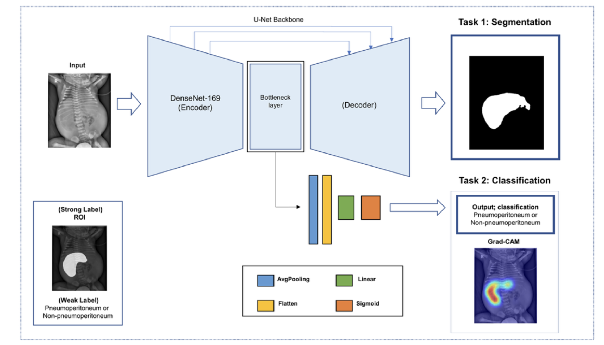

# NEC_MTL: Detection of Neonatal Pneumoperitoneum on Radiographs Using Deep Multi-task Learning

<p align="center"></p>

## 💡 Highlights
- Develop a multi-task learning framework integrating DenseNet-169 as a shared encoder, with task-specific classification (CLS) and segmentation (SEG) heads, enhancing pneumoperitoneum detection by capturing both global and localized features.
- Implement Grad-CAM-based explainability to generate interpretable class activation maps, improving model transparency and aiding clinical decision-making by highlighting critical regions in X-ray images.
- In this retrospective study, the artificial intelligence (AI)-based model demonstrated 84.1% accuracy (95% confidence interval: 80.4–87.8), 72.6% recall (65.7–79.4), and 93.0% precision (89.6–96.4) in detecting neonatal pneumoperitoneum on radiographs from a multicenter external set.

## 📄 Paper
This repository provides the official implementation code for the paper: **"Multi-Task Deep Learning for Detection of Pneumoperitoneum on Plain Radiographs in Neonatal Intensive Care Unit."**

Authors: [Changhyun Park](https://github.com/brody9512), Jinwha Choi, Jisun Hwang, Hana Jeong, Pyeong Hwa Kim, Young Ah Cho, Byong Sop Lee, Euiseok
Jung, Se Hwa Kwon, Minsung Kim, Haesung Jun, Yoojin Nam, Hee Mang Yoon, Namkug Kim

[MI2RL LAB](https://www.mi2rl.co/)

## 💾 Requirements
- torch>=1.13.1
- torchvision>=0.14.1
- segmentation-models-pytorch>=0.3.2
- albumentations>=1.3.0
- monai>=1.1.0
- pydicom>=2.3.1
- tifffile>=2022.8.12
- opencv-python>=4.6.0
- Pillow>=9.0.1
- scikit-image>=0.19.3
- scikit-learn>=1.1.3
- matplotlib>=3.5.3
- tqdm>=4.64.0
- pandas>=1.4.0
- numpy>=1.22.0
- pytorch_grad_cam >= 0.2.1

## 🧱 Repository Structure
```
├── config.py 
├── dataset.py 
├── train.py 
├── test.py 
├── model.py
├── losses.py
├── preprocessing_dcmtopng.py
├── gradcam.py
├── optim.py 
├── utils.py 
├── image 
│ └── figure_final.png 
├── dataset 
│ └── train_dataset.py 
│ └── test_dataset.py
```

## 🗂️ Datasets
Asan Medical Center (AMC) private data
- Due to security regulations in South Korea, the AMC data cannot be disclosed

## 📜 Script Example
### Train
```
--gamma_truefalse --gamma_min 80 --gamma_max 120 --gamma_percentage 0.5   --size 1024  --batch 6  --gpu 5  --rotate_angle 30 --rotate_percentage 0.8  --layers densenet169 --epoch 180  --clip_min 0.5  --clip_max 98.5  --rbc_brightness 0.05 --rbc_contrast 0.2 --elastic_truefalse   --elastic_alpha 15 --elastic_sigma 0.75 --elastic_alpha_affine 0.45  --gaussian_truefalse  --gaussian_min 0  --gaussian_max 10  --feature B0   
```
### Test
```
--gpu 0 --size 1024  --layers densenet169  --external  --weight 0410_densenet169_non_ep180_Lreduce_1024_b6_cla2.0_clip0.5_98.5_rota30.0_rbc_b0.05_c0.2_ela_T_alp15.0_sig0.75_aff0.45_ela_p0.25_gaus_T_0.0_10.0_ho_F_gam_T_80.0_120.0_sizec_F_0.8_resic_F_codp_F_epoch_loss_[]  --model_threshold 0.61940747499  
```

## 🎯 Results: 
### Train
| Class          | Precision | Recall | F1-Score | Support |
|----------------|-----------|--------|----------|---------|
| Normal         | 0.91      | 0.95   | 0.93     | 22      |
| PneumoperiT    | 0.97      | 0.93   | 0.95     | 30      |
| **Accuracy**   |           |        | 0.94     | 52      |
| **Macro Avg**  | 0.94      | 0.94   | 0.94     | 52      |
| **Weighted Avg** | 0.94    | 0.94   | 0.94     | 52      |
> **ROC Curve**: Area = 0.98

### Test
| Class          | Precision | Recall | F1-Score | Support |
|----------------|-----------|--------|----------|---------|
| Normal         | 0.82      | 0.93   | 0.87     | 214     |
| PneumoperiT    | 0.89      | 0.73   | 0.80     | 164     |
| **Accuracy**   |           |        | 0.84     | 378     |
| **Macro Avg**  | 0.85      | 0.83   | 0.83     | 378     |
| **Weighted Avg** | 0.85    | 0.84   | 0.84     | 378     |
> **ROC Curve**: Area = 0.89

## 📝 Citation
```bibitex
@article{nec_mtl,
  title={Detection of Neonatal Pneumoperitoneum on Radiographs Using Deep Multi-task Learning},
  author={Changhyun Park, Jinwha Choi, Jisun Hwang, Hana Jeong, Pyeong Hwa Kim, Young Ah Cho, Byong Sop Lee, Euiseok Jung, Se Hwa Kwon, Minsung Kim, Haesung Jun, Yoojin Nam, Hee Mang Yoon, Namkug Kim},
  year={2025}
}
```

##🙋🏻‍♂️ Acknowledgements
We would like to thank **Junseong Lee** ([@junjslee](https://github.com/junjslee)) for his remarkable contributions to refactoring the code structure and setting up this GitHub repository.


